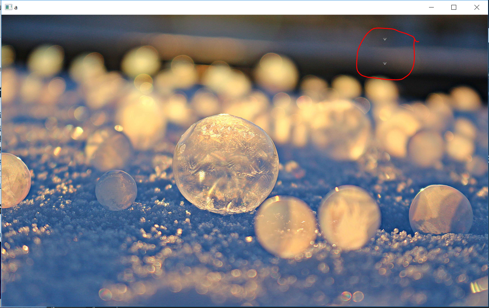
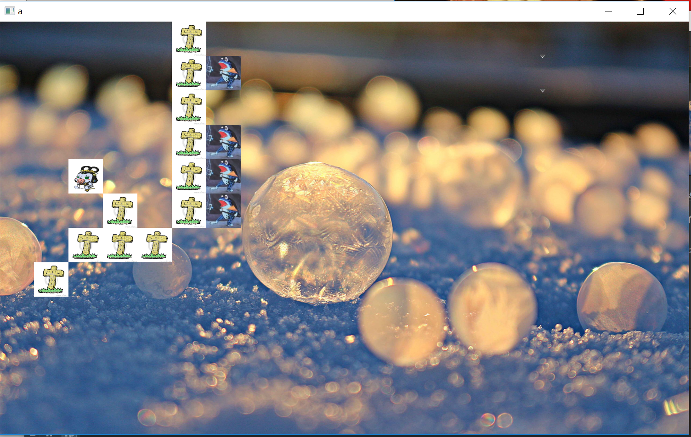

# final project
## 开发环境
#### IDE：IntelliJ IDEA
#### Maven3.6.0
#### java1.8.0_131
## 使用说明
#### 1. 运行程序后先在右上角选择双方的阵型，上方的combobox可以用于选择葫芦娃队的阵型，下方的combobox可以用于选择妖怪队的阵型。共三种阵型，长蛇，鹤翼和雁飞。

#### 2. 按下M键即可开始葫芦娃与蛇精的战斗，关闭程序后可自动保存为game1.xml文件
#### 3. 按下L键即可显示文件选择框以选择合适的xml战斗记录来replay
## 运行效果

## 基本思想
#### 1. 对于M键战斗，先初始化所有进程、地图、生物信息，战斗采用回合制，每个生物轮流活动，活动包括战斗，移动和停止不动，这三种活动每个轮次只能执行其中一种。
#### 2. 对于保存，先在战斗开始前完成相关的初始化操作，再保存双方的阵型信息，在每轮活动中保存相关信息，最后当用户关掉ui界面，把所有的数据保存到game1.xml中
#### 3. 对于复盘，读取xml文件后，先初始化双方阵型，再创建两个线程（生物移动线程和生物战斗线程），每个线程都会改变ui界面，在进程切换间程序会自动执行javafx进程刷新ui。
## 类
### 位置类
#### 为了方便存储二维地址，创建Pos类，可存储二维坐标x和y的值
### 生物类
#### Creature类是一个抽象类，是所有种类生物的父类，重要的方法有battle(), move(), stop()分别为战斗（先寻找周围是否有敌人，若有则与之战斗）、移动（寻找最近的敌人向其靠近）、停止不动（已经战斗过或者无法移动）
#### Calabash、Grandfather、Scorpion、Snake、Underling类均为Creature类的子类
### 地图类
#### Map.java中有一个Body类，内部成员为ArrayList< Creature >类型，代指地图的某个地方可能会存放多个尸体。
#### Map类中主要成员有记录地图某地是否为空的empty，记录地图某地的生物的hold，以及记录地图某地尸体的body，这三个均为二维数组。Map的主要方法为init（初始化）、print（打印在控制台上）、isEmpty(判断某地是否没有生物)、creatureMove（某个生物从某地移动到某地）、beKilled（某地生物被杀）、getCreature（返回在某地的生物）
### SpecialMath类是用于提供数学运算工具的类
### 生物线程类
#### CreatureThread类是Thread类的子类，主要成员有Creature类的对象（指该线程代表的生物）和ImageView类的对象（指该线程代表的生物所用的图片），run方法实现了在synchronized机制下线程的轮换进行。
### Main类
#### Main类是Application类的子类，用于实现ui界面
### 队列类
#### Queue类用于提供队列的初始化方法。
## 游戏机制
### 选择阵型开始战斗后，所有生物都会向敌人靠近，若两个敌对生物横坐标之差和纵坐标之差均小于等于1，则视为可以战斗。每个生物在攻击另一生物时，有50%的几率被反杀，反杀后，该生物死亡，对应的线程图片换为墓碑图片。
## 主要知识体现
### 设计原则
#### SRP原则：每个类均有其特有的功能，若类A需要运用它没有的功能，必须要从其他类调用。
#### OCP原则： 抽象类Creature类易于拓展。
#### LSP原则：子类没有重写父类的方法。
### GUI
#### 使用了javafx的borderpane作为scene的root，往上面添加ImageView类对象时需要设定位置。
### IO
#### 使用了dom读写文件
### 集合类型
#### ArrayList<creature>存放尸体。
### 注解
#### @Override重写和@Test测试
###  异常处理
####  例如try{sleep(100);}catch(Exception e){e.printtracktrace();}
###  继承和多态、封闭
####  多种生物对Creature类的继承，大部分成员为private，需要相应的方法获取；@Override实现多态。
